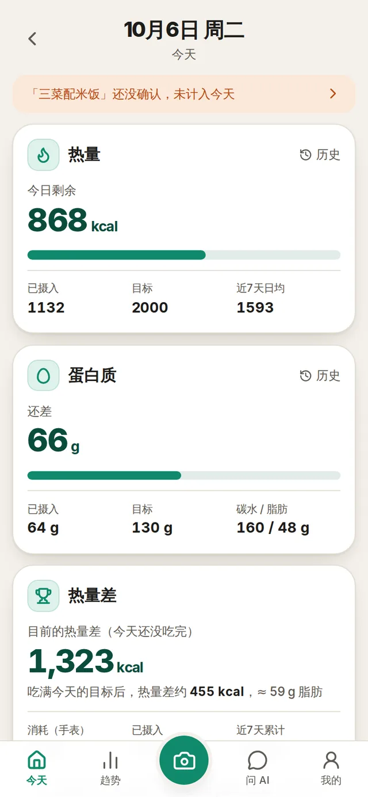
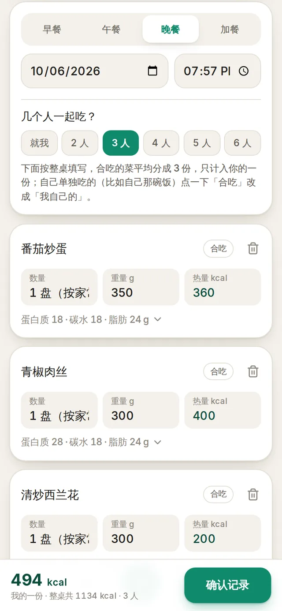
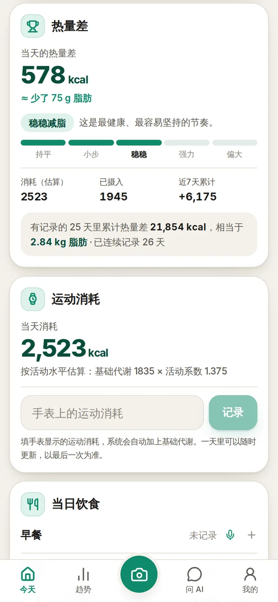
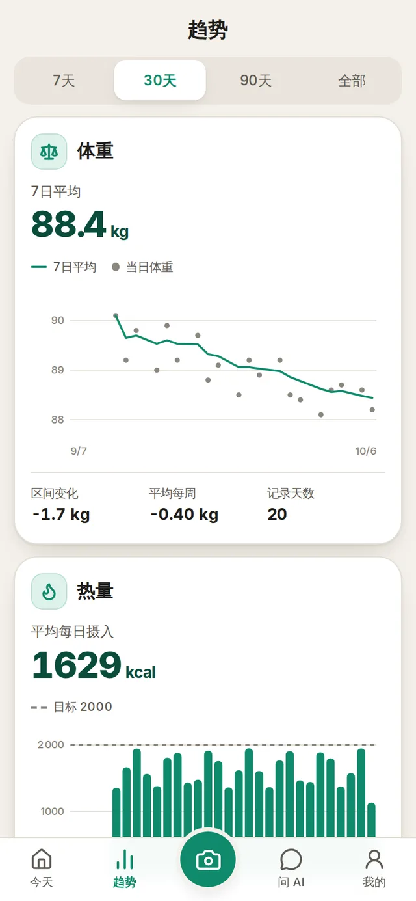
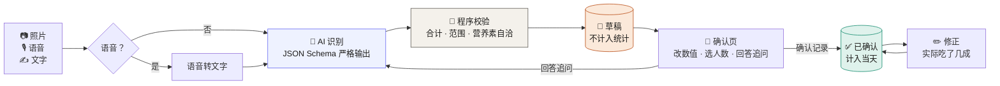
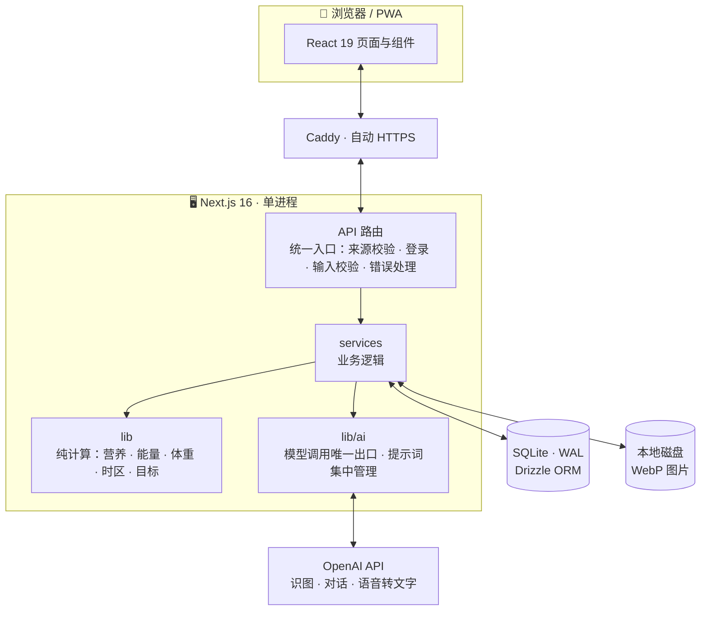
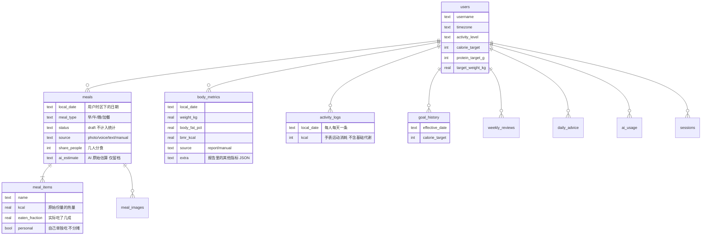
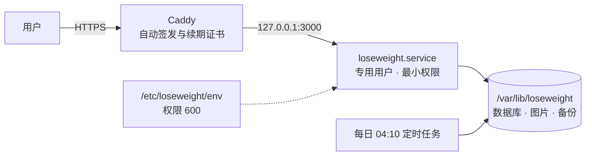

<div align="center">

# 🥗 LoseWeight

### 拍一顿，记一顿 —— 给自己用的 AI 减脂助手

**AI 负责看懂食物，程序负责算清楚账。**

<br>


<br>

<table>
  <tr>
    <td width="25%"></td>
    <td width="25%"></td>
    <td width="25%"></td>
    <td width="25%"></td>
  </tr>
  <tr>
    <td align="center"><b>今天</b><br><sub>剩余热量 · 蛋白质 · 热量差</sub></td>
    <td align="center"><b>确认这顿饭</b><br><sub>几人分食 · 逐项可改</sub></td>
    <td align="center"><b>成就感</b><br><sub>档位 · 折合脂肪 · 手表消耗</sub></td>
    <td align="center"><b>趋势</b><br><sub>7 日均重 · 摄入 · 热量差</sub></td>
  </tr>
</table>

<sub>截图均为演示数据</sub>

</div>

<br>

## 💡 它和「AI 聊天减肥」有什么不同

> 大多数 AI 减肥助手把聊天记录当账本——聊着聊着就忘了你中午吃过什么，心算还经常算错。
>
> LoseWeight 反过来：**数据库是唯一的账本，所有加减乘除都由程序完成**。
> AI 只做它真正擅长的三件事：看图识物、听懂人话、给建议。

| | 🤖 AI 做 | 🧮 程序做 |
|---|---|---|
| **记录** | 认出照片里的每样食物，估份量和营养 | 合计总热量、校验 AI 结果是否自相矛盾 |
| **分食** | 提示「看起来像 3 人的量」 | 按人数分摊，只计入你的一份 |
| **调整** | 把「面条是乌冬面」「米饭剩了一半」变成对清单的精确修改，只重估被改的那一样 | 校验方案、应用到对应的行、按比例重算热量 |
| **身体数据** | 从体脂秤报告截图里**抄**数字 | 范围检查、交叉核对（体重 × 体脂率 ≈ 脂肪量） |
| **复盘** | 通读 7 天数据，八个维度逐一判断，给出三条行动 | 先算好全部合计、平均、占比、对比，再交给 AI；不满 7 天不调用 |
| **目标** | — | 用固定公式推荐，用户点了才采用 |

三条不会被打破的规则：

1. **AI 的估算不直接入账。** 先存为草稿，你确认后才计入当天。
2. **统计只认你确认的数字。** AI 原始估算只留档备查。
3. **AI 不许凭空补充。** 系统数据里没有的，就是没有。

<br>

## ✨ 功能

<table>
<tr>
<td width="50%" valign="top">

### 🍱 记一顿饭 —— 四种方式
- **📷 拍照** —— 底部导航正中间的相机按钮，任何页面一点即拍；一张不够可以在确认页再补，最多 4 张，同一样食物不会重复计算
- **🎙️ 语音** —— 说一句「中午和朋友吃了一盘西红柿炒鸡蛋、一小碗糙米饭」，自动识别餐次、人数、谁吃的
- **🖼️ 相册** —— 选一张或一次选多张已有的照片
- **✍️ 手动** —— 打字描述让 AI 估，或自己逐项填

### 🎚️ 看不清时怎么估
估少一点 / 正常估 / 估多一点。只决定「看不清的地方往哪边取」——油、酱、被遮住的主食、份量；看得清的食物（两个鸡蛋、一罐可乐）三档结果一样。

### 👨‍👩‍👧 多人分食
中国人吃饭不分餐。选「几个人一起吃」，合吃的菜平均分摊；自己那碗饭标成「我自己的」不分摊。

### 🗣️ 不对就说一句
识别完发现不对，不用等记录以后再改：在确认页直接说一句或写一句，例如「面条是乌冬面」「没有卤蛋，还喝了一罐可乐」。AI 只改你提到的那一样并重新估算，其余不动。已经记录的饭同样可以这样改；没吃完也可以说「米饭剩了一半」，或点「主食剩一半」这类快捷按钮。也可以手动改名称后点「按新名称重新估算」。

</td>
<td width="50%" valign="top">

### 🏆 热量差 —— 成就感
今天消耗 − 已摄入，折合成「少了多少克脂肪」，五档评级，外加近 7 天和开始以来的累计。

### ⌚ 运动消耗
把手表上的运动消耗抄过来，当天消耗就以它为准；没填的日子按活动水平估算。

### ⚖️ 身体数据 —— 只传一张图
上传体脂秤报告截图，体重、体脂率、肌肉量等十几项自动录入。同一天重复上传是覆盖。

### 📈 趋势
7 日平均体重（而不是今天比昨天）、每日摄入、每日热量差（吃超的日子向下画）、体脂、腰围。7 / 30 / 90 天 / 全部。

### 📋 7 日 AI 综合分析
最近 7 个完整的自然日（不含今天）都有记录才能用。AI 通读这一周的全部数据，从热量、蛋白质、热量差、饮食结构、进餐规律、体重、运动、记录质量八个维度逐一判断，给出下周要做的三件事。

</td>
</tr>
</table>

<br>

## 🔄 一顿饭是怎么被记下来的



AI 每次返回的内容：每样食物的名称、数量、重量、热量、三大营养素、把握程度、是否个人独食；整桌热量的合理范围（不假装精确）；人数提示；最多 2 个真正影响结果的追问。

程序接着做的事：

- 总热量由各项相加得出，不采用模型自己报的总数
- 模型给的范围必须包住总数，否则退回 ±15%
- 蛋白质×4 + 碳水×4 + 脂肪×9 与热量相差超过 35% 的项目，标成「不太确定」
- 所有数值做范围限制；不是食物就拒绝，并清掉已上传的图片

<br>

## 🧮 计算规则

全部在 `src/lib/` 里，纯函数，有测试覆盖。

<details open>
<summary><b>一顿饭计入多少</b></summary>

```
某一项计入的热量 = 原始热量 × 实际吃掉的比例 ÷ 分摊人数
                                              └ 标成「我自己的」时按 1 人算
```

明细永远保存原始份量；「吃了几成」和「几人分食」单独记录，所以修正和人数都可以反复改。

</details>

<details open>
<summary><b>一天消耗多少</b></summary>

| 情况 | 当天消耗 |
|---|---|
| 录入了手表的运动消耗 | 基础代谢 + 运动消耗 |
| 没有录入 | 基础代谢 × 活动系数（1.2 / 1.375 / 1.55 / 1.725） |

基础代谢优先用体脂秤实测值；没有则用 Mifflin-St Jeor 公式估算。

</details>

<details open>
<summary><b>热量差的档位</b></summary>

| 热量差（kcal） | 档位 | |
|---|---|---|
| 小于 −100 | 今天吃超了 | 明天照常吃，不用补偿 |
| −100 ~ 150 | 基本持平 | |
| 150 ~ 350 | 小步前进 | |
| **350 ~ 750** | **稳稳减脂** | 最健康、最容易坚持 |
| 750 ~ 1000 | 强力燃脂 | 提醒吃够蛋白质 |
| 大于 1000 | 缺口偏大 | **不作为成就鼓励** |

- 折合脂肪按 7700 kcal ≈ 1 kg
- 今天 22 点前且还没记晚餐时，只显示进行中的数字和「吃满目标后」的预估，不评档位
- 累计只统计有饮食记录的日子

</details>

<details>
<summary><b>目标推荐（「我的」页一键更新）</b></summary>

```
每日热量 = 基础代谢 × 活动系数 − 500        （约每周减 0.45 kg）
          且不低于基础代谢，不低于 1200

每日蛋白质 = 去脂体重 × 2.0 g               （有体脂率时）
           = 目标体重 × 1.6 g               （没有体脂率时）
```

不调用 AI。页面上会列出每一步的依据，点「一键更新目标」才会采用。

</details>

<details>
<summary><b>体重趋势</b></summary>

- **7 日平均**：最近 7 天内有记录日的平均值
- **30 天趋势**：线性回归斜率换算成 kg/周；少于 4 个点或跨度不足 7 天时显示「数据不足」，不拿单日波动当趋势
- 同一天多次称重取最后一次

</details>

<details>
<summary><b>「今天」是哪一天</b></summary>

按用户资料里的时区判断，而不是服务器时区。服务器在 UTC 时，北京时间早上 7 点的早餐不会被记到前一天。

</details>

<br>

## 🏗️ 架构



| 层 | 选择 | 为什么 |
|---|---|---|
| 应用 | Next.js 16 (App Router) + TypeScript | 前后端一个进程、一套类型 |
| 数据库 | SQLite (WAL) + Drizzle ORM | 单机零运维，备份就是一个文件；全部参数化查询 |
| 校验 | Zod 4 | 接口输入和 AI 输出用同一套 schema |
| 界面 | Tailwind 4 + 自写组件，图表手写 SVG | 没有组件库和图表库的包袱 |
| AI | OpenAI Responses API，JSON Schema 严格模式 | 结构化输出稳定 |
| 图片 | sharp 重新编码为 WebP，本地磁盘，经 `storage` 接口访问 | 以后换对象存储只改一个文件 |
| 认证 | 用户表 + scrypt 密码 + HttpOnly 会话（库里只存 token 哈希） | 所有业务表带 `user_id`，天然支持多用户 |
| 运行 | systemd + Caddy | 重启自恢复，日志进 journald，自动续签证书 |

<br>

## 🗃️ 数据模型



几个值得一提的设计：

- **`meals.status`** —— 草稿不参与任何统计，24 小时没确认自动清理
- **`meals.ai_estimate`** —— 保存 AI 原始结果、你的描述或语音转写、追问回答和提示词版本号，方便日后追溯
- **`goal_history`** —— 改目标不会改变过去日子的评价标准
- **`ai_usage`** —— 每次模型调用都记一笔，并据此限制每人每天的调用次数

<br>

## 📁 项目结构

```
src/
├── app/
│   ├── (app)/                登录后的页面
│   │   ├── page.tsx            今天
│   │   ├── day/[date]/         任意一天
│   │   ├── meal/[id]/          确认草稿 / 修改 / 修正
│   │   ├── meal/new/           手动记录
│   │   ├── weight/             身体数据
│   │   ├── trends/             趋势
│   │   ├── review/             7 日 AI 综合分析
│   │   └── settings/           目标与资料
│   └── api/                  所有接口，统一经过 lib/http.ts
├── components/               界面组件
├── services/                 业务逻辑
│   ├── meals.ts                饮食：草稿、确认、分食、修正、每日合计
│   ├── metrics.ts              身体数据
│   ├── activity.ts             手表运动消耗
│   ├── profile.ts              资料与目标历史
│   ├── snapshot.ts             交给 AI 的数据快照 + 热量差汇总
│   ├── review.ts               7 天复盘：窗口规则、数据整理、缓存
│   └── assistant.ts            每日建议
├── lib/                      纯计算与通用工具
│   ├── nutrition.ts · energy.ts · goals.ts · weight.ts · time.ts
│   ├── auth.ts · http.ts · images.ts · storage.ts · logger.ts
│   └── ai/
│       ├── prompts.ts          ⭐ 全部提示词集中在这里
│       ├── client.ts           模型调用唯一出口（限额、超时、用量、错误转换）
│       ├── analyze-meal.ts     识别食物
│       ├── edit-meal.ts        按一句话修改一顿饭
│       ├── read-body-report.ts 读体脂秤报告
│       ├── review.ts           7 天复盘
│       └── advisor.ts          每日建议
└── db/schema.ts              表结构（唯一来源）

drizzle/      数据库迁移（自动生成，随代码提交）
deploy/       systemd 单元、Caddyfile、setup.sh、deploy.sh
scripts/      create-user · migrate · maintenance
tests/        10 个测试文件，58 个用例
docs/         README 用的截图
```

<br>

## 🚀 快速开始

需要 Node.js 24。

```bash
git clone <repo> && cd loseweight
npm install

cp .env.example .env.local        # 填入 OPENAI_API_KEY，并把 DATA_DIR 改成 ./data
npm run user:create -- <用户名>    # 创建账号，随机密码只打印这一次

npm run dev                       # http://localhost:3000
```

```bash
npm test             # 58 个测试
npm run typecheck    # 类型检查
```

### 环境变量

| 变量 | 默认 | 说明 |
|---|---|---|
| `OPENAI_API_KEY` | — | **必填**。只在服务端使用，不会进入前端代码 |
| `OPENAI_MODEL` | `gpt-6-astra` | 识图、理解修正、每日建议、复盘用的模型 |
| `OPENAI_TRANSCRIBE_MODEL` | `gpt-4o-transcribe` | 语音转文字 |
| `DATA_DIR` | `./data` | 数据库、图片、备份都在这里 |
| `APP_ORIGIN` | — | 对外地址，如 `https://lw.example.com`，用于校验请求来源 |
| `IMAGE_RETENTION_DAYS` | `90` | 原图保留天数，之后只留缩略图 |
| `AI_DAILY_LIMIT` | `200` | 每人每天 AI 调用上限，防止费用失控 |

<br>

## 📦 部署

目标环境：一台全新的 Ubuntu 24.04，2 GB 内存够用。

```bash
git clone <repo> /opt/loseweight && cd /opt/loseweight

sudo deploy/setup.sh lw.example.com    # ① 装环境、配置 HTTPS 和服务（可重复执行）
sudo nano /etc/loseweight/env          # ② 填 OPENAI_API_KEY
sudo deploy/deploy.sh                  # ③ 测试 → 构建 → 重启 → 健康检查
```

`setup.sh` 做的事：加 swap、装 Node.js 24 / Caddy / sqlite3、开防火墙（只放行 22 / 80 / 443）、建专用系统用户和目录、写 Caddy 配置、注册 systemd 服务和每日定时任务。

`deploy.sh` 做的事：`npm ci` → 类型检查 → 测试 → 构建 → 重启 → 等健康检查通过。**以后每次改完代码只需要再跑一次它。**



- 应用只监听本机，由 Caddy 对外提供 HTTPS
- 服务器重启后，应用、Caddy、定时任务全部自动恢复
- 域名经过 Cloudflare 代理时，SSL 模式应设为 Full (strict)

### 数据库迁移

```bash
# 1. 修改 src/db/schema.ts
npm run db:generate      # 2. 生成迁移文件到 drizzle/，检查后提交
sudo deploy/deploy.sh    # 3. 部署；应用启动时自动执行未应用的迁移
```

<br>

## 🛠️ 日常维护

```bash
systemctl status loseweight                    # 运行状态
journalctl -u loseweight -f                    # 实时日志（每行一个 JSON）
journalctl -u loseweight --since today | grep '"level":"error"'
systemctl restart loseweight                   # 重启
journalctl -u loseweight-maintenance -n 20     # 昨晚的备份和清理结果
ls /var/lib/loseweight/backups                 # 数据库备份
```

需要以服务用户身份执行的命令：

```bash
run() { sudo -u loseweight env $(grep -v '^#' /etc/loseweight/env | xargs) "$@"; }
cd /opt/loseweight

run npm run user:create -- <用户名>    # 新建用户；已存在则重置密码
run npm run maintenance               # 立即备份并清理
```

**每日维护任务**（04:10 自动执行）：

| 做什么 | 规则 |
|---|---|
| 备份数据库 | 保留最近 14 天 |
| 清理草稿 | 超过 24 小时没确认的草稿连同图片一起删除 |
| 图片瘦身 | 超过 `IMAGE_RETENTION_DAYS` 的原图删除，只留缩略图 |

<details>
<summary><b>从备份恢复</b></summary>

```bash
systemctl stop loseweight
cp /var/lib/loseweight/backups/loseweight-YYYY-MM-DD.db /var/lib/loseweight/loseweight.db
rm -f /var/lib/loseweight/loseweight.db-wal /var/lib/loseweight/loseweight.db-shm
chown loseweight:loseweight /var/lib/loseweight/loseweight.db
systemctl start loseweight
```

</details>

> ⚠️ 备份和数据在同一块硬盘上，防的是误操作，不是硬盘损坏。

<br>

## 🔒 安全与隐私

| | |
|---|---|
| 🔑 **密钥** | 只存在服务器的 `/etc/loseweight/env`（权限 600），不进代码仓库，不进前端 |
| 👤 **登录** | scrypt 加盐哈希；数据库只存会话 token 的哈希；同一来源 15 分钟内失败 8 次即锁定 |
| 🧱 **数据隔离** | 所有按 id 的读写都带 `user_id` 条件 |
| 🛡️ **接口** | 统一入口校验请求来源、登录状态和输入；内部错误只记日志，前端只看到通用提示 |
| 🖼️ **图片** | 不信任文件名和类型，由 sharp 实际解码；重新编码并去掉 EXIF（含拍摄地点）；只能由本人通过需登录的接口读取 |
| 🎙️ **录音与报告截图** | 用完即弃，不落盘；只保存转出的文字和数值 |
| 🚪 **进程** | 专用系统用户运行，systemd 限制为只能写数据目录和构建缓存 |

<br>

## 🧠 提示词

全部集中在 [`src/lib/ai/prompts.ts`](src/lib/ai/prompts.ts)，文件开头写明了四条原则：

1. 模型只做看图、估份量、解释、建议；**算术一律交给程序**
2. 给模型的用户数据全部来自数据库，由 `services/snapshot.ts` 渲染
3. 需要结构化结果的地方一律用 JSON Schema 严格模式，输出再经程序校验
4. 改了识别类提示词要升版本号 —— 版本号随 AI 原始估算一起存档

现有五份提示词：识别食物、按一句话修改、读体脂秤报告、每日建议、7 天复盘。识别和修改共用同一段估算规则。

<br>

## 🗺️ 还没做的

- [ ] 根据 14 天真实减重速度，主动建议调整目标
- [ ] 异地备份
- [ ] 离线可用

<br>

<div align="center">
<sub>为每天真的会用而做，不是 Demo。</sub>
</div>
